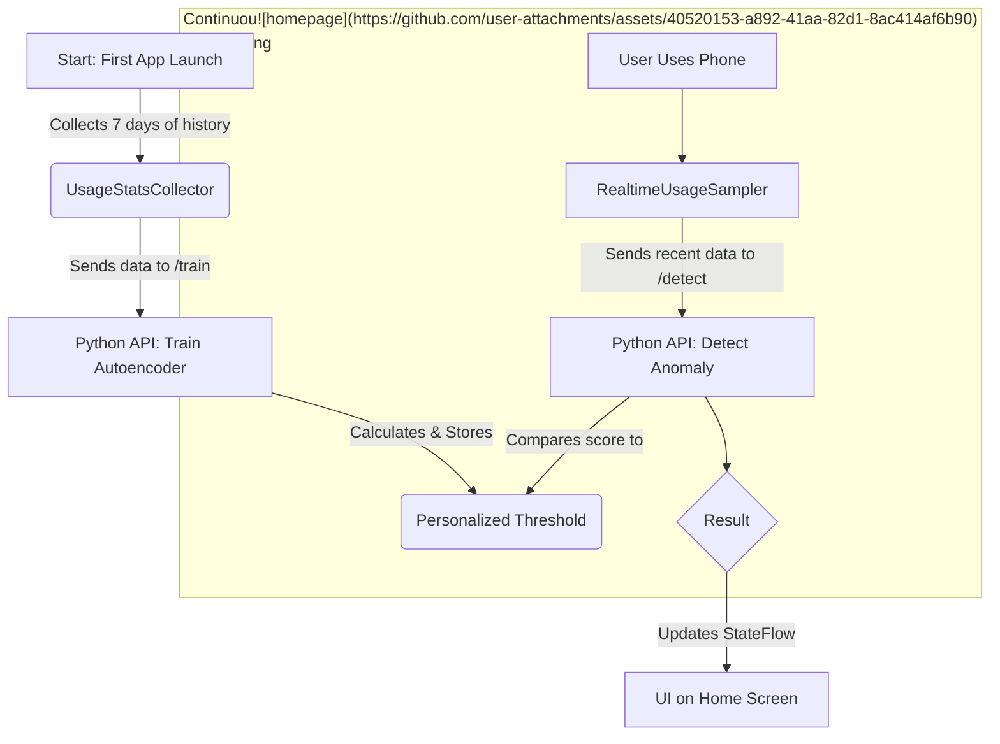

# Android Launcher for Behavioural Profile

This project is my bachelor's thesis, an intelligent Android launcher designed to provide a "post-unlock" security layer, and also user behaviour based app recommendations. It acts as a second line of defense by learning your unique app usage habits and detecting anomalous behavior in real-time, while providing an efficient finding of apps.

## Core Concept

The fundamental idea is to create a profile of a user's normal smartphone interaction. The application monitors which apps are used, when they are used, for how long, and how frequently.

-   **Normal Usage:** When your activity matches your learned profile, the system remains in a normal state.
-   **Anomalous Usage:** If a pattern emerges that significantly deviates from your normal routine (e.g., a rarely used app being launched repeatedly at an odd hour), the system flags it as an anomaly and raises the security level.

## Features

-   **Custom Home Screen:** A clean home screen with a live system status indicator, floating cards for app suggestions, risky apps based on permissions, and easy access to other parts of the launcher.
-   **App Drawer & Search:** A standard, scrollable app drawer listing all installed applications with a functional search bar to quickly find any app.
-   **Usage Statistics:** A detailed statistics page showing key metrics like the most used app, average daily usage, total app launches, and the most active day of the week.
-   **Real-time Anomaly Detection:** The core security feature that constantly evaluates recent app usage against the trained user profile.
-   **Past 24h Application Usage** Page that shows each app and it's time used in the past 24 hours.

## Architecture & Tech Stack

The project is split into two main components: the Android client and a Python backend for the machine learning model.

### Android Client

-   **Language:** Kotlin
-   **UI:** Jetpack Compose
-   **Architecture:** MVI (Model-View-Intent)
-   **Key Libraries:**
    -   Hilt for Dependency Injection
    -   Room for the local database
    -   Retrofit for networking
    -   Coroutines & Flow for asynchronous tasks

### Backend Server

-   **Language:** Python
-   **Framework:** FastAPI
-   **Machine Learning:** TensorFlow (Keras) to build the Autoencoder model.

## How It Works: The Data Lifecycle

The system operates in a continuous cycle, ensuring the user's profile is both established and monitored.

## Screenshots

<table>
  <tr>
    <td align="center"><b>Home Screen</b></td>
    <td align="center"><b>App Drawer</b></td>
    <td align="center"><b>App Search</b></td>
  </tr>
  <tr>
    <td></td>
    <td></td>
    <td></td>
  </tr>
  <tr>
    <td align="center"><b>Statistics Page</b></td>
    <td align="center"><b>24-Hour Usage</b></td>
  </tr>
  <tr>
    <td></td>
    <td></td>
  </tr>
</table>
